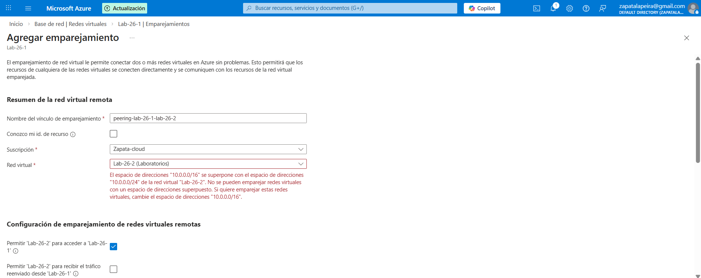
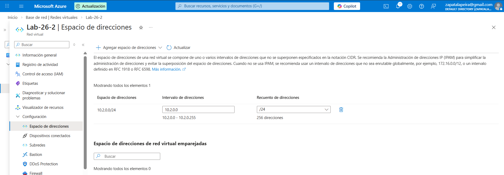
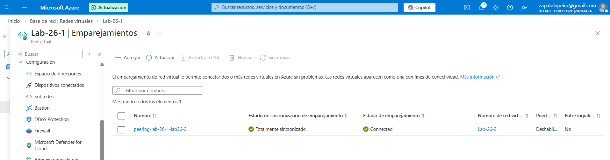

## Objetivo
Reproducir un error típico al hacer VNet Peering: dos redes con rangos de IP que se solapan. Identificar la causa, corregir el address space y dejar el peering en estado conectado.

## Qué ha pasado (incidencia)
Al intentar emparejar dos VNets, Azure bloquea el peering porque los espacios de direcciones tienen solapamiento. Con peering, las redes deben ser únicas para poder enrutar correctamente.

## Resolución
He modificado el address space de una de las VNets para eliminar el solapamiento y, tras eso, el peering ha quedado en estado **Connected**.

## Evidencias

### 01 – Error por solapamiento (IP Overlap)

### 02 – Cambio de address space para evitar solapamiento

### 03 – Peering en estado Connected

## Qué diría en entrevista
“Cuando un peering falla por IP overlap, no es un problema de permisos: es de diseño de red. Lo resuelvo ajustando CIDR para que no se solapen y validando el estado del peering.”
